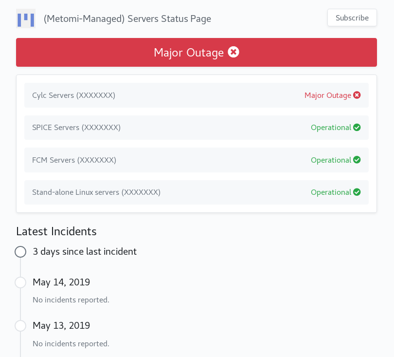
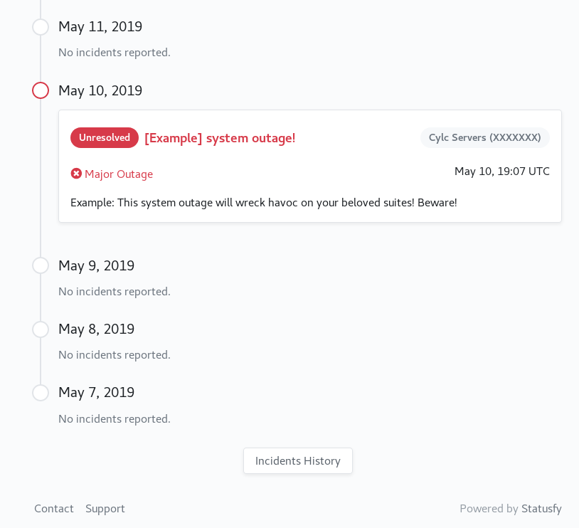

# metomi-serverstatus-demo


### Context

**Proof of concept** for a **server status page** that our team could
consider using (or something similar to it) so that users can see clearly
at any time whether our systems are fully operational as far as we are
aware, etc. I think this *could* reduce the amount of user queries raised with
us regarding potential issues, & generally be a helpful resource to users.


### Implementation


#### Tech

Created with the Vue-based system **Statusfy**:

* [GitHub repo](https://github.com/bazzite/statusfy)
* [Docs](https://docs.statusfy.co/guide/)
* Generic [demo](https://demo.statusfy.co/)


#### Demo setup

For this demo, I've [configured](https://docs.statusfy.co/config/)
Statusfy so this system page:

  * displays relevant information for our team (as a changeable example);
  * has a theme displaying the Metomi logo and favicon, instead of the
    generic Statusfy logo;
  * links to our specific 'Contact' & 'Support' pages at the foot of the page.

*Note* I have omitted specific details that should not be shared openly, to
enable the repository to be public. In practice, I envision we replace
``XXXXXX...`` with the names of our servers, as relevant in each case, &
possibly split these up further into (e.g. Cylc Server ``X``, Cylc Server
``Y`` & so on instead of having a Cylc Servers group).

The current demo renders server ``items`` with dispalyed names as under the
``titles`` key here (from the basic config in ``locales/en.json``):

```json
{
  "systems": {
    "items": {
      "Cylc servers": {
        "title": "Cylc Servers (XXXXXXX)"
      },
      "SPICE servers": {
        "title": "SPICE Servers (XXXXXXX)"
      },
      "FCM Servers": {
        "title": "FCM Servers (XXXXXXX)"
      },
      "Standalone servers": {
        "title": "Stand-alone Linux servers (XXXXXXX)"
      }
    }
  }
}
```


### Demo screenshots





### To build

To build this to have a play around with:

* check out this repo (``master`` branch);
* ensure you have a conda or virtual environment & can run ``npm``, via
  ``nodejs`` if necessary. Use ``npm install npx`` to install ``npx``;
* follow the steps outlined in the [Installation section of the Statusfy docs](https://docs.statusfy.co/guide/getting-started/#installation), ignoring the
  parts under "It will be generated a basic structure for your project..." &
  "You can create a new incident with:". In short, execute:

    ```console
    $ npx statusfy init
    $ npm install
    $ npm run dev
    $ npm run generate
    ```
* In a browser, open the endpoint for the running service pointed to by the
  STDOUT log message.


### Some thoughts on potential

The system was easy to setup & configure. Additionally, I found it really
straightforward to
[add "incidents"](https://docs.statusfy.co/guide/incidents/), the Statusfy
term for highlighted events which relate to the status of the items (in
this case the servers).

If we think this *could* be worthwhile to setup, then we could:

* trial it; or
* directly ask users via e.g. a poll if they thought a status page in general,
& this variation specifically, would be useful to them?

Thoughts?

Either of the above would first require deploying the page, which can be done
most readily by hosting with GitHub pages, but for this we need a custom
domain to use, as hosting under a standard GitHub user
``<username>.github.io/...`` domain is
[not supported](https://docs.statusfy.co/guide/deploy/#github-pages)
(otherwise I would have setup one here for this demo).
